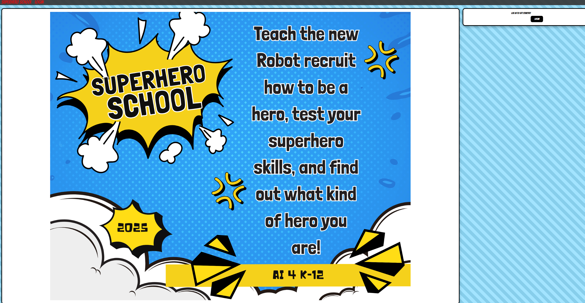
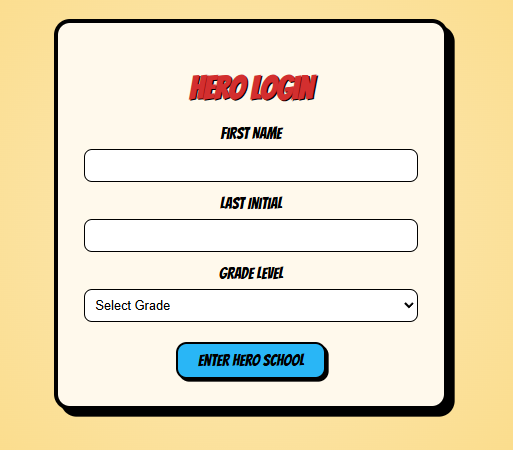
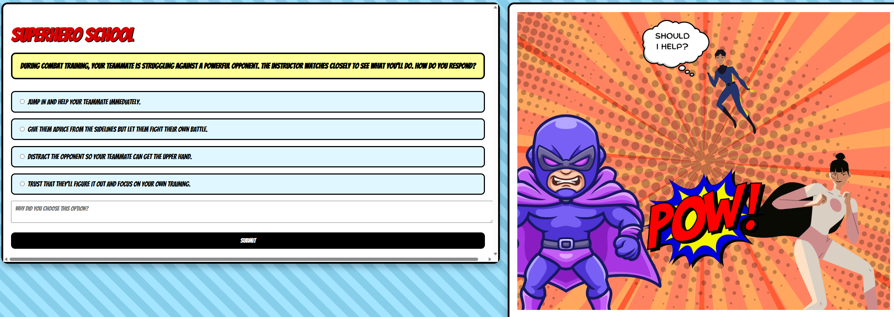
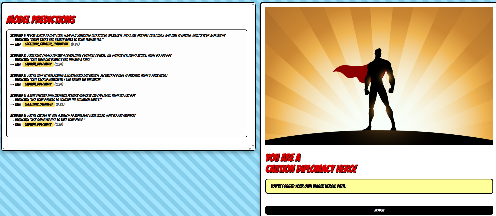

# 🦸 SuperHeroSchool AI Demo

An interactive scenario-based quiz that uses machine learning to analyze 
a student's decision-making style and predict their hero type. The project is 
designed to teach K-12 students core AI concepts through a superhero-themed activity.

---

## 📸 Screenshots

<table>
  <tr>
    <th>Home</th>
    <th>Login</th>
  </tr>
  <tr>
    <td></td>
    <td></td>
  </tr>
  <tr>
    <th>Quiz</th>
    <th>Results</th>
  </tr>
  <tr>
    <td></td>
    <td></td>
  </tr>
</table>

---

## 🧠 How It Works

1. Students log in with their name and grade
2. They are presented with moral/ethical scenarios and pick a choice + reasoning
3. Their responses are embedded using SentenceTransformers and used to train
   a Logistic Regression classifier in real time
4. The trained model predicts how the student would respond to unseen scenarios
5. A final **hero type** is assigned based on their overall decision pattern

---

## 🗂️ Project Structure

```
AI4K12-DataCollection/
├── server.py                  # Flask web server + routes
├── scripts/
│   ├── app.py                 # Core quiz logic and flow controller
│   ├── prediction.py          # ML training and prediction engine
│   └── datacollection.py      # Session logging per student
├── scenarios/
│   ├── UserScenarios.json     # Scenarios shown to the student
│   └── ModelScenarios.json    # Scenarios used for model prediction
├── templates/
│   ├── home.html
│   ├── login.html
│   └── index.html
├── screenshots/               # README screenshots
└── logs/                      # Auto-generated student session logs
```

## ⚙️ Setup & Installation

**1. Clone the repo**
```bash
git clone https://github.com/your-username/your-repo-name.git
cd AI4K12-DataCollection
```

**2. Install dependencies**
```bash
pip install flask sentence-transformers scikit-learn numpy
```

**3. Run the server**
```bash
python server.py
```

**4. Open in your browser**
http://127.0.0.1:5000

---

## 📋 Routes

| Route | Method | Description |
|-------|--------|-------------|
| `/` | GET | Home page |
| `/login` | GET/POST | Student enters name + grade |
| `/submit` | POST | Submits a choice + reason, returns next scenario |

---

## 📁 Student Logs

Every session is automatically saved to the `logs/` folder as:
Each log includes the student's choices, reasoning, tags, and final prediction.

---

## 🛠️ Tech Stack

- **Backend:** Flask (Python)
- **ML:** Scikit-learn, SentenceTransformers (`all-MiniLM-L6-v2`)
- **Logging:** Custom session logger
- **Frontend:** HTML/CSS (Jinja2 templates)

---

## 📌 Notes

- `test.py` is a standalone neural network experiment, not part of the main app
- Designed for classroom use with K-12 students
- Screenshots should be placed in the `screenshots/` folder
